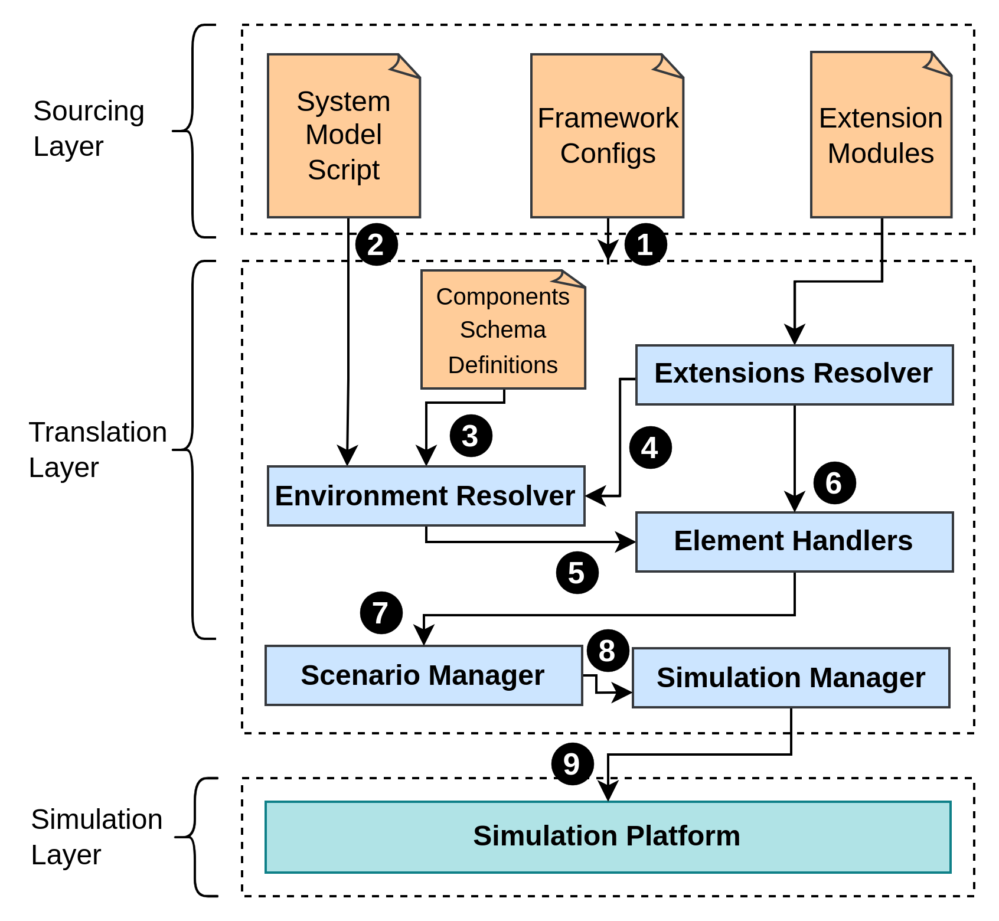

# CloudSim Express: Low-Code Simulation Framework for CloudSim

---
If you use this software in your work, please cite the CloudSim Express paper (Submitted to Journal of Software: Practice and Experience ([Pre-print available at Arxiv](https://arxiv.org/abs/2311.00974))
```
@misc{2311.00974,
Author = {Tharindu B. Hewage and Shashikant Ilager and Maria A. Rodriguez and Rajkumar Buyya},
Title = {CloudSim Express: A Novel Framework for Rapid Low Code Simulation of Cloud Computing Environments},
Year = {2023},
Eprint = {arXiv:2311.00974},
}
```
---

[](https://github.com/Cloudslab/cloudsim-express/actions/workflows/maven.yml)

CloudSim Express is a low-code framework to implement, deploy, and share CloudSim simulations. 
It takes a human-friendly scripting approach to boost the productivity of CloudSim simulation life-cycle. 
- **Low-Code Simulation Designs**
  - Design simulations via a human-readable script
- **Simplified Extensions**
  - Standardization of writing custom extensions
  - Improved maintainability
  - Less boilerplate code
- **Deploy as a tool**
  - Human-readable script to update simulation scenario, and one-liner execution
  - Isolation of extensions for simplified implementations, and deployments
  - Implement locally, and deploy remotely
- **Accelerated Idea-to-implementation**
  - Re-use human-readable simulation designs and isolated custom extensions
  - Zero-code transferring from existing simulations

The rest of this document explore CloudSim Express in-details.
- [Why did we implement CloudSim Express?](#why-did-we-implement-cloudsim-express)
- [Simulation Life Cycle Comparison: CloudSim vs CloudSim Express](#comparison-of-simulation-life-cycles-cloudsim-vs-cloudsim-express)
- [Introduction to Scripted Simulations](#introduction-to-scripted-simulation)
- [Writing Extensions](#writing-extensions)
- [Deploying CloudSim Express](#deploying-cloudsim-express)
- [Inner Workings of CloudSim Express](#inner-workings-of-cloudsim-express)
- [Stability](#stability)
- [Releasing CloudSimExpress](#releasing-cloudsimexpress)
- [Contributing](#contributing)

The example usages of CloudSim Express is available in [CloudSim Express - User Guide](docs%2Findex.md).

### Why did we implement CloudSim Express?

---

We observed that even though the CloudSim is a powerful tool used extensively by the research community, its development 
life-cycle is often a chaos. This is primarily because it's a Java library, and a standard development framework
is not available. Therefore, researchers tend to use their own implementation approaches, which then lead to 
implementations that are practically impossible to maintain. Due to that, any spin-off research work are not able to 
re-use already available implementations as a starting point, rather re-implementing most of the code.

On the other hand, modern simulations quite often involves computationally heavy, 
large scale simulations. For example, the Azure public VM traces dataset v2 
is 235 GB large and contain ~2.6M VMs with 1.9B utilization readings. In such simulations, researchers offload executions
into a high performance server via a cloud service. There is not a standard way available to implement CloudSim simulations in a 
modularized manner to address such scenarios.

Lastly, we noticed that CloudSim simulations requires quite-a-bit of expertise in implementing Java 
projects. This drastically increases the time that is required to implement a simulation, and even applies to the simple
examples. We think this is unfair for the research community, especially for a new user.

Focusing on these drawbacks, we are implementing CloudSim Express to revamp the entire simulation life-cycle of CloudSim.
CloudSim Express introduces a human-readable scripting approach to define simulation scenarios, a standard way of 
writing extensions, and a simplified deployment approach. The script-based approach significantly reduces code-based 
implementations. In the cases of simple examples, it completely eliminates the need to implement Java code. 

### Comparison of Simulation Life cycles: _CloudSim_ vs _CloudSim Express_

---

A typical CloudSim simulation life cycle involves following steps.

- Designing cloud infrastructure (i.e., Host count, processing elements count, etc).
- Writing extensions to simulate a specific simulation scenario. In this comparison, we implement a custom workload 
submission component.

#### CloudSim Implementation

1. Create a new Java project, and configure CloudSim as a dependency.
2. Define the cloud infrastructure by writing Java code.
```java
// Import libraries
import org.cloudbus.cloudsim.Cloudlet;
import org.cloudbus.cloudsim.CloudletSchedulerTimeShared;
import org.cloudbus.cloudsim.Datacenter;
...

// Initialize the toolkit
int num_user=1;   // number of cloud users
Calendar calendar=Calendar.getInstance();
...
```
3. Implement extensions in the same project by writing java code.
```java
...
int id = 0;
long length = 400000;
long fileSize = 300;
long outputSize = 300;
UtilizationModel utilizationModel = new UtilizationModelFull();
...
```
4. Build the project, and execute.
```text
...
Starting CloudSimExample1...
Initialising...
Starting CloudSim version 3.0
Datacenter_0 is starting...
...
```

#### CloudSim Express Implementation

1. Download the CloudSim Express tool.
2. Define cloud infrastructure in a human-readable script.
```yaml
...
Zone: &Zone
  name: "default zone"
  datacenter: *Datacenter
  broker:
    variant:
      className: "org.cloudbus.cloudsim.DatacenterBroker"
    name: "RegionalBroker"
  workloadGenerator:
    variant:
      className: "org.crunchycookie.research.distributed.computing.cloudsim.workload.impl.DummyWorkloadGenerator"
GlobalDatacenterNetwork:
  zoneCount: 1
  interZoneNetworkDescriptionFilePath: "./sample-data/aws-geo-distributed-datacenter-inter-network-data.csv"
  zones:
    - <<: *Zone
      name: "REGIONAL_ZONE_VIRGINIA"
...
```
3. Implement extensions independently, and package as jar files. Then copy the jar files into the CloudSim Express tool.
```java
...
public class DummyWorkloadGenerator implements CloudSimWorkloadGenerator {

    public static final int TASK_COUNT = 100;
    private final List<Cloudlet> cloudletList;

    public DummyWorkloadGenerator() {

        cloudletList = new ArrayList<>();
...
```
5. Execute the simulation via a CLI command.
```text
...
$ sh cloudsim-express.sh
2023-04-02 01:58:46,522 [main] INFO  org.cloudbus.cloudsim.express.simulator.impl.DefaultCloudSimExpressSimulator - Initializing the Low-code simulator...
2023-04-02 01:58:46,526 [main] INFO  org.cloudbus.cloudsim.express.simulator.impl.DefaultCloudSimExpressSimulator - Using Extension Resolver: class org.cloudbus.cloudsim.express.resolver.impl.JARExtensionsResolver
2023-04-02 01:58:46,650 [main] INFO  org.cloudbus.cloudsim.express.simulator.impl.DefaultCloudSimExpressSimulator - Using Environment Resolver: class org.cloudbus.cloudsim.express.resolver.impl.YAMLEnvironmentResolver
2023-04-02 01:58:46,650 [main] INFO  org.cloudbus.cloudsim.express.simulator.impl.DefaultCloudSimExpressSimulator - Using Simulation Handler: class org.cloudbus.cloudsim.express.handler.impl.cloudsim.DefaultGlobalDatacenterNetworkHandler
2023-04-02 01:58:46,651 [main] INFO  org.cloudbus.cloudsim.express.simulator.impl.DefaultCloudSimExpressSimulator - Using Scenario Manager: class org.cloudbus.cloudsim.express.manager.impl.DefaultScenarioManager
Initialising...
...
```

### Introduction to Scripted Simulations

---

At the heart of CloudSim Express lies the simulation script, which describes the model of the simulation system. In which 
a system model is built ground-up using re-usable components as building blocks, via a human-readable scripting language.

We opted for YAML as the human-readable scripting language, which is extensively utilized in various applications, 
from defining APIs to maintaining configuration files. As a result, it is a familiar sight for CloudSim users.

#### Re-usable components

The CloudSim Express currently offers following re-usable components. 
- **ProcessingElement**
- **ProcessingElementProvisioner**
- **Host**
- **Datacenter**
- **Broker**
- **Zone**
- **GlobalDatacenterNetwork**

Our goal is to cover most of the standard cloud infrastructure. However, these components may not be sufficient for a 
certain simulation. For which we invite the community to contribute to the project using our standard approach of implementing
such components. This approach is discussed in the following sections.
- [Schematics of re-usable components](#schematics-of-re-usable-components)
- [Usage of re-usable components](#usage-of-re-usable-components)
- [How does a re-usable component convert scripted object, into the CloudSim implementation?](#how-does-a-re-usable-component-convert-scripted-object-into-the-cloudsim-implementation)
- [Introducing a new re-usable component](#introducing-a-new-re-usable-component)

##### _Schematics of re-usable components_

We use a separate YAML script to define schematics of re-usable components, which is the
[simulation-elements.yaml](core/src/main/resources/simulation-elements.yaml) file. Each component is defined
as an object in YAML with attributes. For example, the _Host_ object schematics is as follows.
```yaml
Host:
  type: object
  properties:
    variant:
      $ref: '#/components/schemas/Extension'
    id:
      type: integer
    ramProvisioner:
      $ref: '#/components/schemas/Extension'
    bwProvisioner:
      $ref: '#/components/schemas/Extension'
    storage:
      type: integer
    processingElementList:
      type: array
      items:
        $ref: '#/components/schemas/ProcessingElement'
    vmScheduler:
      $ref: '#/components/schemas/Extension'
```

##### _Usage of re-usable components_

Components defined with the [simulation-elements.yaml](core/src/main/resources/simulation-elements.yaml) is
readily available to be used by the CloudSim Express tool. For example, the same _Host_ component is now used
to define a specific host instance in the system-model script file of CloudSim Express.

```yaml
Host: &Host
  variant:
    className: "org.cloudbus.cloudsim.Host"
    copies: 1
  id: -1
  ramProvisioner:
    className: "org.cloudbus.cloudsim.provisioners.RamProvisionerSimple"
    extensionProperties:
      - key: "ram"
        value: "515639"
  bwProvisioner:
    className: "org.cloudbus.cloudsim.provisioners.BwProvisionerSimple"
    extensionProperties:
      - key: "bw"
        value: "100000000"
  vmScheduler:
    className: "org.cloudbus.cloudsim.VmSchedulerTimeShared"
  storage: 1000000
  processingElementList: *ProcessingElementList
```

##### _How does a re-usable component convert scripted object, into the CloudSim implementation?_

During the project build, the schematics in the [simulation-elements.yaml](core/src/main/resources/simulation-elements.yaml)
file are converted to Plain-old-java-objects (PoJo). Then, a specific handler extending [Base Element Handler](core/src/main/java/org/cloudbus/cloudsim/express/handler/impl/BaseElementHandler.java)
class is written with necessary logic to covert scripted object information into a CloudSim simulation. During
runtime, the corresponding handler is selected by the tool to process all scripted objects.

##### _Introducing a new re-usable component_

In this case, the developer needs to follow the approach below.

1. Define the schematic in the [simulation-elements.yaml](core/src/main/resources/simulation-elements.yaml) file.
2. Build the project to generate the corresponding PoJo (this is automatically handled via OpenAPI 3.0 libraries).
3. Write a new element handler for the component by extending the [Base Element Handler](core/src/main/java/org/cloudbus/cloudsim/express/handler/impl/BaseElementHandler.java).
4. Add the new handler to the end of the priority list in [cloudsim-express-configs.properties](core%2Fsrc%2Fmain%2Fresources%2Fcloudsim-express-configs.properties) file.
5. Build the project again to obtain the updated CloudSim Express tool. Afterward, the new component can be used in the simulation system model script.


#### Scripting with Re-usable Components

In CloudSim Express, the re-usable components are used to write the system model of the simulation. For example, a 
cloud availability zone can be made up with a datacenter having 10 hosts. This can be written in YAML in the following
manner.
```yaml
...
Host: &Host
  variant:
    className: "org.cloudbus.cloudsim.Host"
    copies: 1
  id: -1
  ramProvisioner:
    className: "org.cloudbus.cloudsim.provisioners.RamProvisionerSimple"
    extensionProperties:
      - key: "ram"
        value: "515639"
  bwProvisioner:
    className: "org.cloudbus.cloudsim.provisioners.BwProvisionerSimple"
    extensionProperties:
      - key: "bw"
        value: "100000000"
  vmScheduler:
    className: "org.cloudbus.cloudsim.VmSchedulerTimeShared"
  storage: 1000000
  processingElementList: *ProcessingElementList
HostList: &HostList
  - <<: *Host
    variant:
      className: "org.cloudbus.cloudsim.Host"
      copies: 10
Datacenter: &Datacenter
  variant:
    className: "org.cloudbus.cloudsim.Datacenter"
  characteristics: *Characteristics
  vmAllocationPolicy:
    className: "org.cloudbus.cloudsim.VmAllocationPolicySimple"
  storage: ""
  schedulingInterval: 0
  name: "regional-datacenter"
Zone: &Zone
  name: "default zone"
  datacenter: *Datacenter
  broker:
    variant:
      className: "org.cloudbus.cloudsim.DatacenterBroker"
    name: "RegionalBroker"
  workloadGenerator:
    variant:
      className: "org.crunchycookie.research.distributed.computing.cloudsim.workload.impl.DummyWorkloadGenerator"
      extensionProperties:
        - key: "workloadPercentage"
          value: "11"
        - key: "isRandomPercentage"
          value: "true"
        - key: "dataFolder"
          value: "../external-dependencies/data/workload/bitbrain-dataset/fastStorage"
...
```

Notice how the system model is built from ground up, each component wrapping another.
The top-most component in this situation is the `Zone`. Once we have that, we use a reserved 
component called `SimulationSystemModel` to let the CloudSim Express to know that which component defines the 
simulation system model.
```yaml
...
SimulationSystemModel:
  name: 'Zone'
...
```

### Writing Extensions

---

We introduce a standard approach to write extensions via system model YAML file using the keyword, `variant`. It is an attribute of 
a re-usable component. For example, a datacenter is an extension point. An extension of a datacenter is identified by
its class name. Therefore in the system model script, a datacenter can have the attribute `variant`. In the example below,
we use the default datacenter class `org.cloudbus.cloudsim.Datacenter`.

```yaml
...
Datacenter: &Datacenter
  variant:
    className: "org.cloudbus.cloudsim.Datacenter"
    extensionProperties:
      - key: "sampleProperty"
      - value: "11"
  characteristics: *Characteristics
  vmAllocationPolicy:
    className: "org.cloudbus.cloudsim.VmAllocationPolicySimple"
  storage: ""
  schedulingInterval: 0
  name: "regional-datacenter"
...
```

The schematic of the `variant` attribute is defined with the `Extension` component in [simulation-elements.yaml](core%2Fsrc%2Fmain%2Fresources%2Fsimulation-elements.yaml).
```yaml
Extension:
  type: object
  properties:
    className:
      type: string
    copies:
      type: integer
    extensionProperties:
      type: array
      items:
        $ref: '#/components/schemas/Property'
```

As observed, any number of custom properties can be supplied to an extension as key, value pairs. This allows 
managing custom properties too, via the system model script file.

In order to consume the defined properties, the researcher must implement the interface [CloudSimExpressExtension.java](core%2Fsrc%2Fmain%2Fjava%2Forg%2Fcloudbus%2Fcloudsim%2Fexpress%2Fresolver%2FCloudSimExpressExtension.java).
For the previous example, if the researcher wants to use a custom datacenter class, then that class must implement 
the above-mentioned interface, which provides APIs to consume the properties.

The extensions are packed as jars and copied into the `extensions` folder of the CloudSim Express tool. During the
runtime, they are loaded into the JVM and looked-up using the class name defined in the script.

### Deploying CloudSim Express

---

Once this project is built, the CloudSim Express tool is released into the `/release-artifacts` folder as a zipped file.
Once unzipped, the tool has the following file structure.
```text
├── cloudsim-express.sh
├── configs.properties
├── extensions
│   └── workload-generators-0.1.jar
├── log4j2.properties
├── logs
│   └── cloudsim-1680488172390.log
├── sample-data
│   └── aws-geo-distributed-datacenter-inter-network-data.csv
├── scenarios
│   └── system-model.yaml
└── simulator.jar
```
- `extensions` folder
  - Copy all custom class file jars into this folder.
- `scenarios` folder
  - The `system-model.yaml` file is used to define the simulation system model in YAML using the re-usable components.
- `cloudsim-express.sh` file
  - The tool is executed alongside with this file using the command, `sh ./cloudsim-express.sh`

This root folder can be copied into any remote machine and simply executed in the same manner. Most of the 
simulation parameter updates can be done via the system model script file, and re-run the simulation without 
even compiling java code. Also, introduction of an extension can also be easily done by copying the extension
jar and configuring the system model script file.

### Inner Workings of CloudSim Express

---


- **Environment Resolver**: Process the system model script file into PoJo objects, and assign a handler to proceed.
- **Extensions Resolver**: Read and create instances from extension classes during runtime.
- **Element Handler**: Convert each component from script to corresponding java implementations.
- **Scenario Manager**: Find and executes the element handler corresponds to the root simulation scenario.
- **Simulation manager**: Initialize CloudSim and starts executing the scenario.

Most of the components from above are extensible. To use a customized version, implement the
corresponding class, pack as a jar, and copy into the `extensions` folder. Then change the
default component to the extended version by modifying the `configs.properties` file.

### Stability

---

The current version of CloudSim Express is fairly stable, and we are proud to say that it has already
contributed to a potential research work. However, it is not extensively tested regarding error handling.
A misconfiguration could well run into a weird error.

We would appreciate opening GitHub issues for such cases. If you are able to,
please provide as much information as you can, to help us to tackle the issue. 

You can start a remote debugging session with CloudSim Express by executing the simulation with
`java -jar -agentlib:jdwp=transport=dt_socket,server=y,suspend=y,address=*:6006 simulator.jar configs.properties` 
command. Connect via the port 6006. This will allow you to collect
additional information, and even to fix the issue! In that case, please
follow the Contributing guidelines and send us a pull request.

### Releasing CloudSim Express

---

Once built, the `/release-artifacts` folder contains the artifacts.

### Contributing

---

- Open a GitHub issue and clearly describe the issue/feature-request.
- Fork the project, implement and test, and create a pull request.
- Wait until automated build passes with your PR.
- Upon successfully PR with the automatic build, a CloudsLab organization member will merge your contribution.

Please kindly refer to the project licence.
